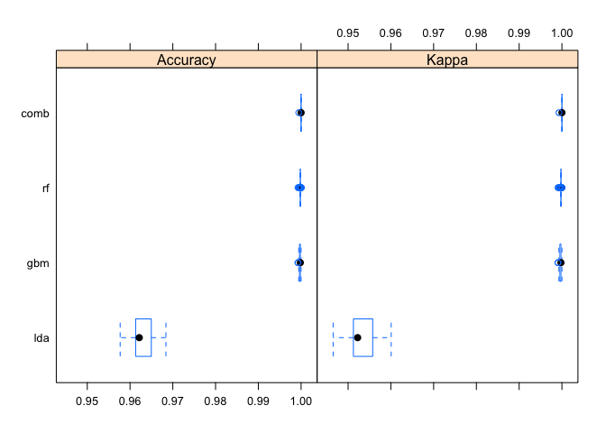
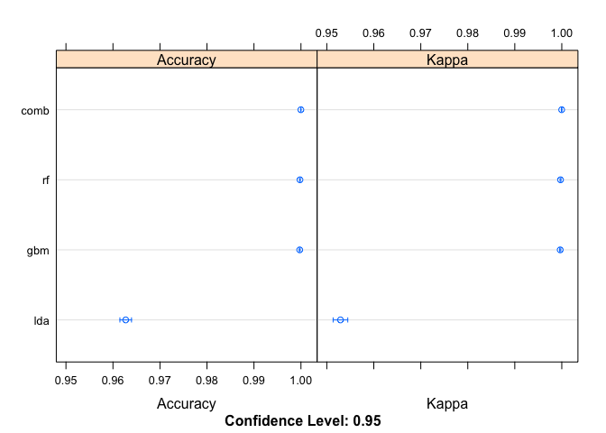

John Hopkins Practical Machine Learning Report
================

Introduction
------------

The project for this course is to use machine learning to predict the manner in which a group did excercise. The following objectives are to be met as part of this report: \* Describe how you built your model \* How you used cross validation \* Why you made the choices you did

### Project Setup

First, include required libraries, create folders, and download files

``` r
# Include libraries
library(caret)
```

``` r
# Create data folder if it does not exist
dataFolder = "data"
if (!file.exists(dataFolder)) {
        dir.create(dataFolder)
}
```

``` r
# Download test files if they do not exist
trainInput <- "https://d396qusza40orc.cloudfront.net/predmachlearn/pml-training.csv"
testInput <- "https://d396qusza40orc.cloudfront.net/predmachlearn/pml-testing.csv"
trainDisk <- file.path(dataFolder,"training.csv")
testDisk <- file.path(dataFolder, "test.csv")

if (!file.exists(trainDisk)) {
        download.file(trainInput, destfile = trainDisk, method = "curl")
}

if (!file.exists(testDisk)) {
        download.file(testInput, destfile = testDisk, method = "curl")
}
```

### Prepare Data

Next we need to load, clean, and partition our data sets

``` r
# Read the downloaded csv files into data frames
trainCsv <- read.csv(trainDisk)
testCsv <- read.csv(testDisk)

# Next I used View(trainCsv) and I see lots of NA Values. Lets remove those first.
trainCsv <- trainCsv[, colSums(is.na(trainCsv)) == 0]
testCsv <-  testCsv[, colSums(is.na(testCsv)) == 0]

# Again I used View(trainCsv) and there are some obvious columns that are not useful
dropCol <- c("user_name", "raw_timestamp_part_1", "raw_timestamp_part_2", "cvtd_timestamp", "new_window", "num_window")
trainCsv <- trainCsv[, -which(names(trainCsv) %in% dropCol)]
testCsv <- testCsv[, -which(names(testCsv) %in% dropCol)]

# Even with this a Random Forest with 200 trees was still taking forever
# so lets turn our classe into a factor and set it aside for a moment
trainClasse <- as.factor(trainCsv$classe)

# Next lets strip out everything non-numeric
trainCsv <- trainCsv[, sapply(trainCsv, is.numeric)]
testCsv <- testCsv[, sapply(testCsv, is.numeric)]

# Then put our classe back
trainCsv$classe <- trainClasse

# Finally partition the data
set.seed(19622)
inTrain <- createDataPartition(trainCsv$classe, p = 3/4)[[1]]
training <- trainCsv[inTrain,]
testing <- trainCsv[-inTrain,]
```

Model Building
--------------

Next we are going to build three different models and then combine the models and see what accuracy we get from each scenario

``` r
# Random Forest
mod_rf <- train(classe ~ ., data = training, method = "rf")
# Boosted
mod_gbm <- train(classe ~ ., data = training, method = "gbm", verbose=FALSE)
# Latent allocation
mod_lda <- train(classe ~ ., data = training, method = "lda")

# Run predictors
pred_rf <- predict(mod_rf, testing)
pred_gbm <- predict(mod_gbm, testing)
pred_lda <- predict(mod_lda, testing)

# Combined
predDF <- data.frame(pred_rf, pred_gbm, pred_lda, classe = testing$classe)
combModFit <- train(classe ~ ., method = "rf", data = predDF)
combPred <- predict(combModFit, predDF)
```

### Model Comparisons

Now that our models are built, we can compare the results.

``` r
results <- resamples(list(rf=mod_rf, gbm=mod_gbm, lda=mod_lda, comb=combModFit))
summary(results)
```

    ## 
    ## Call:
    ## summary.resamples(object = results)
    ## 
    ## Models: rf, gbm, lda, comb 
    ## Number of resamples: 25 
    ## 
    ## Accuracy 
    ##           Min.   1st Qu.    Median      Mean   3rd Qu.      Max. NA's
    ## rf   0.9992693 0.9998129 0.9998151 0.9997863 0.9998177 1.0000000    0
    ## gbm  0.9992631 0.9996291 0.9998142 0.9997342 0.9998170 1.0000000    0
    ## lda  0.9576887 0.9613146 0.9621581 0.9627126 0.9649734 0.9683882    0
    ## comb 0.9994490 1.0000000 1.0000000 0.9999780 1.0000000 1.0000000    0
    ## 
    ## Kappa 
    ##           Min.   1st Qu.    Median      Mean   3rd Qu.      Max. NA's
    ## rf   0.9990771 0.9997632 0.9997663 0.9997298 0.9997694 1.0000000    0
    ## gbm  0.9990680 0.9995310 0.9997655 0.9996637 0.9997682 1.0000000    0
    ## lda  0.9465013 0.9512403 0.9522315 0.9529067 0.9557554 0.9600779    0
    ## comb 0.9993036 1.0000000 1.0000000 0.9999721 1.0000000 1.0000000    0

As you can see, the predicted accuracy of Random Forest and Boosted are nearly identical. By combining all three, we can get an insignificantly higher accuracy.

Here you can see the results as a box plot:

``` r
bwplot(results)
```



Here are the results as a dot plot

``` r
dotplot(results)
```



### Model Selection

As the results of Random Forest, Boosted, and Combined were all above 99%, I am going to select the Random Forest model. Let's go ahead and re-build the model with five fold cross validation and a larger forest.

``` r
# Cross validation
cv <- trainControl(method="cv", 5)
mod_rf <- train(classe ~., data=training, method="rf", trControl=cv, ntree=250)
# View results
mod_rf
```

    ## Random Forest 
    ## 
    ## 14718 samples
    ##    53 predictor
    ##     5 classes: 'A', 'B', 'C', 'D', 'E' 
    ## 
    ## No pre-processing
    ## Resampling: Cross-Validated (5 fold) 
    ## Summary of sample sizes: 11773, 11774, 11775, 11774, 11776 
    ## Resampling results across tuning parameters:
    ## 
    ##   mtry  Accuracy   Kappa    
    ##    2    0.9982334  0.9977655
    ##   27    0.9997961  0.9997422
    ##   53    0.9996603  0.9995703
    ## 
    ## Accuracy was used to select the optimal model using the largest value.
    ## The final value used for the model was mtry = 27.

Next, let's estimate against the validation set.

``` r
pred_rf <- predict(mod_rf, testing)
confusionMatrix(testing$classe, pred_rf)
```

    ## Confusion Matrix and Statistics
    ## 
    ##           Reference
    ## Prediction    A    B    C    D    E
    ##          A 1395    0    0    0    0
    ##          B    0  949    0    0    0
    ##          C    0    0  855    0    0
    ##          D    0    0    0  804    0
    ##          E    0    0    0    0  901
    ## 
    ## Overall Statistics
    ##                                      
    ##                Accuracy : 1          
    ##                  95% CI : (0.9992, 1)
    ##     No Information Rate : 0.2845     
    ##     P-Value [Acc > NIR] : < 2.2e-16  
    ##                                      
    ##                   Kappa : 1          
    ##  Mcnemar's Test P-Value : NA         
    ## 
    ## Statistics by Class:
    ## 
    ##                      Class: A Class: B Class: C Class: D Class: E
    ## Sensitivity            1.0000   1.0000   1.0000   1.0000   1.0000
    ## Specificity            1.0000   1.0000   1.0000   1.0000   1.0000
    ## Pos Pred Value         1.0000   1.0000   1.0000   1.0000   1.0000
    ## Neg Pred Value         1.0000   1.0000   1.0000   1.0000   1.0000
    ## Prevalence             0.2845   0.1935   0.1743   0.1639   0.1837
    ## Detection Rate         0.2845   0.1935   0.1743   0.1639   0.1837
    ## Detection Prevalence   0.2845   0.1935   0.1743   0.1639   0.1837
    ## Balanced Accuracy      1.0000   1.0000   1.0000   1.0000   1.0000

Finally, we can see the overall estimated accuracy for the Random Forest model:

``` r
accuracy <- postResample(pred_rf, testing$classe)
accuracy
```

    ## Accuracy    Kappa 
    ##        1        1

Summary
-------

In conclusion, we went with the Random Forest model because: \* It gave nearly the same accuracy as Boosted \* Performed much faster than building and combinding with the other algorithims \* With estimated accuracy of 99%, there is little need for improvement

Our final Random Forest model was built using five fold cross validation.
